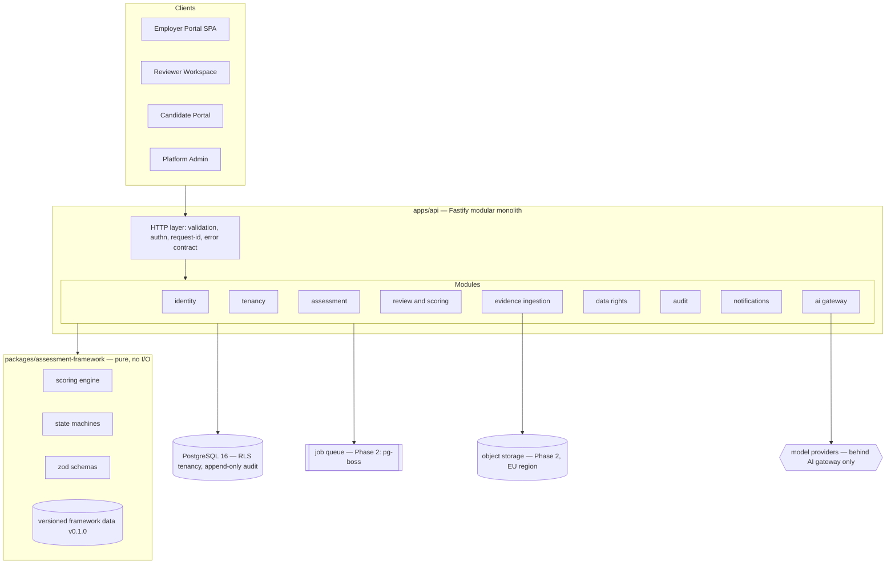

# Architecture Overview

## Style: modular monolith with a pure domain core (ADR-0001)

## Layering rules (enforced in review)

1. `packages/assessment-framework` imports nothing but `zod` and `node:fs`
   (data loading). It never touches HTTP, DB, or providers. All guardrail
   logic lives here or in DB constraints — both testable without mocks.
2. API modules depend on the domain package; never the reverse.
3. Every external system (DB, mail, models, storage) sits behind a module-local
   adapter interface.
4. Model output and all client input are untrusted: zod at every boundary.
5. Tenant context flows as an explicit parameter and becomes
   `SET LOCAL app.current_org_id` — RLS is the enforcement backstop
   (defence in depth; the app layer also filters).

## Trust boundaries

| Boundary | Controls |
|---|---|
| Internet → API | TLS, security headers, body limits, rate limits (Phase 2), authn |
| API → DB | Least-privilege role, RLS, parameterised SQL only |
| API → model providers | AI gateway: allow-list, pinning, redaction, budgets, kill switch (ADR-0005) |
| Candidate workspace → evidence ingestion | Category allow-list; forbidden event types rejected (API + DB CHECK); disclosure precondition |
| Reviewer/employer views | Role-scoped projections — employers never receive raw evidence or integrity streams |

## Deployment reference (target, not yet provisioned)

Single container image (API) + managed PostgreSQL (EU region) + object storage
(EU) + managed queue table (pg-boss on same PG initially). Horizontal scale =
stateless API replicas. Region expansion path documented in
scalability-and-capacity.md. Local dev: docker-compose (PG + Mailpit).

## Observability

Structured JSON logs with request IDs and secret redaction (✅ implemented);
OpenTelemetry traces + metrics (Phase 1 remainder); audit chain for
business-material events (✅ schema). Golden signals + product signals
(completion rate, challenge rate, reviewer minutes, adjudication rate).

## Failure design

Timeouts on all external calls; bounded retries with jitter; queue with
dead-letter (Phase 2); AI unavailable → human-only review path always works;
session auto-save and resume; feature flags for risky paths; migrations
additive-only with rollback notes.
