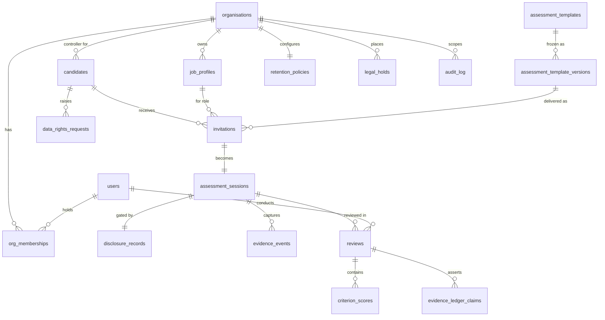

# Logical Data Model

Implemented in migrations 0001–0002. Physical DDL is authoritative; this is the
navigable view.

## Design rules

1. **Tenant column everywhere.** Every tenant table carries `organisation_id`
   with RLS (ADR-0003) — including child tables (`criterion_scores`,
   `evidence_ledger_claims`) so isolation never depends on joins.
2. **Immutability where trust demands it.** Template versions (checksummed),
   disclosure records, audit log (append-only trigger), evidence events.
3. **State machines in enums.** `session_status`, `invitation_status`,
   `review_status`, `data_rights_status` mirror the domain machines 1:1 —
   there is deliberately no `rejected` candidate state anywhere.
4. **Category separation.** `evidence_event_category` implements the five-way
   split (workspace evidence / integrity signal / system audit / reviewer
   decision / employer access) with different retention and audiences.
5. **Secrets never stored raw.** Invitation `token_hash` only; password_hash
   is Argon2id (Phase 1 identity module); no plaintext anything.
6. **Data classification.** Candidate PII (name, email) confined to
   `candidates` + `disclosure_records` (user agent); evidence payloads are
   pseudonymisable by severing the session→candidate link (anonymise mode).

## Data classification table

| Table | Class | Notes |
|---|---|---|
| candidates | Personal (identifying) | Minimise fields; unique (org,email) |
| disclosure_records | Personal + accountability | Retained beyond evidence per matrix |
| evidence_events (workspace) | Personal (work product) | Primary capability evidence |
| evidence_events (integrity) | Personal (behavioural metadata) | Shortest retention; never raw to employers |
| criterion_scores / ledger claims | Evaluative personal data | Subject to access/rectification rights |
| reviews | Evaluative + reviewer accountability | Reviewer identity is professional data |
| audit_log | Accountability | May reference subjects; retained longest |
| assessment_template_versions | Non-personal IP | Public-safe content |

## Indexing (initial, evidence-based additions later)

FK access paths indexed (`invitations.candidate_id`, `evidence_events(session_id,
occurred_at)`, `reviews(reviewer_user_id, status)`, `audit_log(organisation_id,
occurred_at desc)`); unique constraints double as lookups (org+email,
token_hash, review+criterion). Query-plan review is a pilot-exit task.
