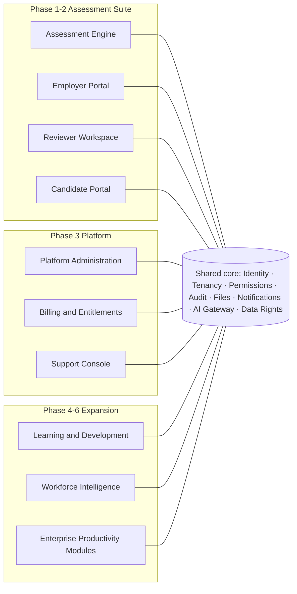

# Discovery — Stakeholders, Roles, and Ecosystem Map

Date: 2026-07-25

## Stakeholder map

| Stakeholder | Interest | Power | Key concern |
|---|---|---|---|
| Candidates | Fair, transparent, accessible assessment; data rights | Low individually, high collectively (trust, law) | Being judged by a black box; surveillance |
| Employers (hiring managers) | Better hiring evidence, less rework, defensible decisions | High (buyer) | Signal quality, time-to-decision, legal exposure |
| Reviewers | Efficient, well-scaffolded review work; calibration support | Medium | Evidence quality, workload, liability for judgements |
| Employer org admins | User/role management, retention config, compliance ops | Medium | Control, auditability |
| CPF platform team | Operate, support, improve the platform | High | Reliability, cost, reputation |
| Co-founders / investors | Commercial viability, defensibility, credible roadmap | High | Wedge decision, unit economics, compliance risk |
| Data protection authorities & AI Act market surveillance | Lawful processing, high-risk AI obligations | Very high (veto) | Art. 22, transparency, oversight, logging |
| Works councils / employee representatives (learning & intelligence phases) | Proportionate, non-surveillance analytics | High in DE/FR/NL etc. | Monitoring creep |

## User roles (permission model foundation)

| Role | Scope | Primary surfaces |
|---|---|---|
| `platform_admin` | CPF platform org | Admin console: employers, subscriptions, feature flags, compliance ops, template library |
| `org_admin` | One employer org | Org setup, users, roles, retention policy, compliance centre |
| `hiring_manager` | Org / assigned jobs | Jobs, candidates, invitations, reports (profiles only — never raw evidence) |
| `reviewer` | Assigned sessions | Reviewer workspace: evidence, rubric, ledger claims, finalisation |
| `support_agent` | Scoped, time-bound | Support console (just-in-time access, fully audited) |
| `learning_admin` | Org (Phase 4) | Courses, pathways, learning analytics |
| Candidate | Own sessions only | Candidate portal (token-scoped identity, not an org member) |

Full grants: see product/permission-matrix.md.

## Ecosystem map (modules and phase)

## Non-user affected people

- Rejected candidates (decision made by employer, informed by CPF evidence) —
  contestability and explanation routes are mandatory product features.
- Employees whose workflows feed Workforce Intelligence (Phase 5) — analytics
  must be aggregate, transparent, and never individual surveillance.
